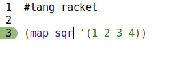
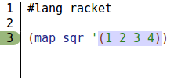
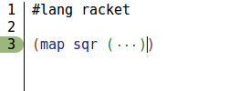

# drracket-collapse-atomic

This tool adds a keybinding to DrRacket that collapses the nearest S-expression to the text cursor. The default keybinding is `c:s:space` (temporary). Invoking the keybinding on an expression that has been collapsed expands it again. The placeholders for collapsed expressions are the same as those used in the more limited DrRacket collapsing functionality, so they can also be expanding using the existing right-click menu item.

Unlike the functionality of the default *Collapse S-expression* item in the right-click menu of DrRacket, S-expressions collapsed using this tool can be atomic:




Sequences of S-expressions can also be collapsed as one unit by selecting them and then invoking the tool:


For compound S-expressions, the expression that will be collapsed by the tool is the same one indicated by DrRacket's default parenthesis highlighting:




If the text cursor is of equal distance from two different S-expressions, the one collapsed will be the one on the left.

## Installation

```
$ raco pkg install https://github.com/adhameer/drracket-collapse-atomic.git
```

## Notes

Selections are expanded to contain entire S-expressions before collapsing as follows: the start position of the selection is moved over to the start of the nearest S-expression to the start of the selection, and the end position of the selection is moved over to the end of the nearest S-expression to the end of the selection. As a result, one can get strange results that straddle S-expressions if the start and end of one's selection are not located in sibling S-expressions.

The collapse/expand function is installed into DrRacket's keymap under the name "collapse atomic s-expression", and it can be remapped using that name; see [Defining Custom Keybindings in DrRacket](https://docs.racket-lang.org/drracket/Keyboard_Shortcuts.html#%28part._defining-shortcuts%29).

When using the built-in *Collapse S-expression* function, quotes, quasiquotes, and unquotes (using the shorthand `'`, `` ` ``, and `,`) are not collapsed when the contained expression is. They are collapsed with the contained expression when collapsed using this tool. A visually similar effect to the built-in behaviour can be achieved by selecting the elements of the quoted expression (as in the second example above) and collapsing them all as a unit.
